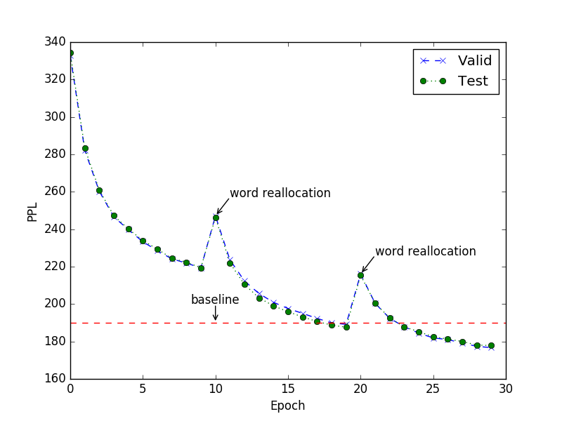
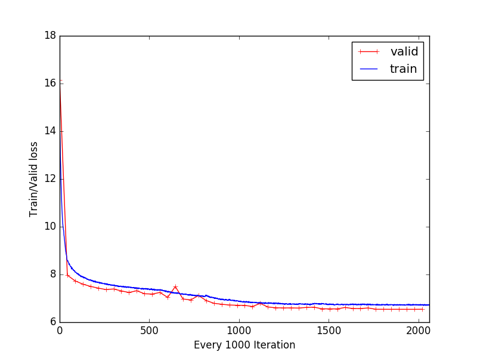

# LightRNN

This is the official implementation for [LightRNN: Memory and Computation-Efficient Recurrent Neural Networks](https://arxiv.org/abs/1610.09893) in CNTK.

## LightRNN: Memory and Computation-Efficient Recurrent Neural Networks
Recurrent neural networks (RNNs) have achieved state-of-the-art performances in many natural language processing tasks, such as language modeling and machine translation. However, when the vocabulary is large, the RNN model will become very big (e.g., possibly beyond the memory capacity of a GPU device) and its training/inference will become very inefficient. LightRNN addresses this challenge using 2-Component (2C) shared embedding for word representations. It allocates every word in the vocabulary into a table, each row of which is associated with a vector, and each column associated with another vector. Depending on its position in the table, a word is jointly represented by two components: a row vector and a column vector. Since the words in the same row share the row vector and the words in the same column share the column vector, we only need $2 \sqrt{|V|}$ vectors to represent a vocabulary of $|V|$ unique words, which are far less than the $|V|$ vectors required by existing approaches. The LightRNN algorithm significantly reduces the model size and speeds up the training/inference process for corpora with large vocabularies.

> For more details please refer to the NIPS 2016 paper (https://arxiv.org/abs/1610.09893)

## Requirements

- CNTK
- Python 2.7 or later. 

__For multi gpu version__
- mpi program
- mpi4py (It is recommended to build mpi4py from source so it's compatible with your MPI program.)

## Details

### [LightRNN/](LightRNN/)
The folder [LightRNN](LightRNN/) contains main structure of LightRNN.

 - __[converter.py](LightRNN/converter.py)__
    Implement some functions which are used to process vocabulary and randomly initialize the word allocation table.
 - __[data_reader.py](LightRNN/data_reader.py)__
    A overridden UserMinibatchSource which maps text to streams.
 - __[lightrnn.py](LightRNN/lightrnn.py)__
    The computation graph of LightRNN
 - __[reallocate.py](LightRNN/reallocate.py)__
    Word reallocation implemented in Python.
 - __[preprocess.py](LightRNN/preprocess.py)__
    The preprocess procedure of LightRNN
    - Options
        - `-datadir <string> (required)`, Path to the data. Put all the corpus 
        - `-outputdir <string> (required)`, Path to save output files.
        - `-vocab_file <string> (default: vocab.txt)`, Save the vocabulary to this file in the outputdir.
        - `-alloc_file <string> (default: word-0.location)`, Save the file of word allocation table in the outputdir.
        - `-vocabsize <int> (default: 10000)`, Vocabulary size.
        - `-seed <int> (default: 0)`, Random seed.
 - __[train.py](LightRNN/train.py)__
    The training procedure of LightRNN
    - Data options
        - `-datadir <string> (required)`, Path to the data, should contain train_file, valid_file and test_file.
        - `-train_file <string> (default: train.txt)`, The training data. 
        - `-valid_file <string> (default: valid.txt)`, The validation data.
        - `-test_file <string> (default: test.txt)`, The test data.
        - `-vocabdir <string> (default: WordInfo)`, Path to the word allocation table and vocabulary.
        - `-vocab_file <string> (required)`, The (input) vocabulary file in the vocabdir.
        - `-alloc_file <string> (default: word-0.location)`, The (input) file of word allocation table in the vocabdir.
        - `-outputdir <string> (default: Models)`, Path to save LightRNN models.
        - `-pre_model <string> (default: None)`, Continue training by loading this existing model file. By default, we train from scratch. 
    - Model options
        - `-embed <int> (default: 512)`, Dimension of word embedding.
        - `-nhid <int> (default: 512)`, Dimension of hidden layer.
        - `-layer <int> (default: 2)`, Number of layers.
        - `-dropout <float> (default: 0.2)`, Dropout rate.
        - `-lr <float> (default: 0.15)`, Learning rate.
        - `-optim <string> (accepted: sgd, adam, adagrad, default: sgd)`, The optimization method which provides sgd, adam and adagrad.
        - `-seqlength <int> (default: 32)`, number of timesteps to unroll for.
        - `-vocabsize <int> (default: 10000)`, Vocabulary size.
        - `-batchsize <int> (default: 20)`, Minibatch size.
    - Other options
        - `-epochs <list> (default: None)`, Number of epochs in every round
        - `-freq <int> (default: 100)`, Report status every this many iterations.
        - `-save <string> (default: model.dnn)`, Save the model to the file with this suffix.

Run the example under [LightRNN](LightRNN/) as follows:

__Preprocess__

`python preprocess.py -datadir ../PTB/Data -outputdir ../PTB/Allocation -vocab_file vocab.txt -alloc_file word-0.location -vocabsize 10000 -seed 0`

So, we will generate the sampled vocab named as *vocab.txt* and a random initial word allocation table under *../PTB/Allocation*.

__Train__

`python train.py -datadir ../PTB/Data -vocab_file ../PTB/Allocation/vocab.txt -vocabdir ../PTB/Allocation -vocabsize 10000 -epochs 12 13 -nhid 1000 -embed 1000 -optim adam -lr 0.1 -batchsize 20 -layer 2 -dropout 0.5`

This command will train a LightRNN model of 2 layers with 1000 hidden units and embedding dimension of 1000. The training procedure contains two rounds, with 12 epochs in the first round and 13 epochs in the second round. The word reallocation table will be optimized and updated after every round.

__Multi-GPU__

`mpiexec -n 2 python train.py -datadir ../PTB/Data -vocab_file ../PTB/Allocation/vocab.txt -vocabdir ../PTB/Allocation -vocabsize 10000 -epochs 12 13 -nhid 1000 -embed 1000 -optim adam -lr 0.1 -batchsize 20 -layer 2 -dropout 0.5`

This command will train a LightRNN model on two GPUs, you can specify the GPU number by using `mpiexec -n [gpus]`.

### [PTB/](PTB/)
This folder contains an example of PTB dataset. You can use [download_data.py](PTB/Data/download_data.py) under [Data/](PTB/Data) to download the data and [generate.py](PTB/Allocation/generate.py) under [Allocation/](PTB/Allocation) to generate a vocabulary file and random table.

### Generate C++ dynamic library

We provide two implementations of word allocation using Python and C++ separately. If you don't use a C++ dynamic library, the Python implementation will be used. The Python version will be 5 times or more slower than C++ version. Therefore, C++ version is preferred.

__For Linux User__

Run the [Makefile](Makefile) in this directory by `make`.

__For Windows User__

Use the Visual Studio to open the project under the [DLL](https://github.com/Microsoft/LightRNN/tree/master/DLL) folder and build, put the dll file under the [LightRNN](LightRNN/).

## Experiment

### [ACL-French](https://www.dropbox.com/s/m83wwnlz3dw5zhk/large.zip?dl=0)
The ACLW French corpus contains about 56M tokens, with a vocabulary of 136912 words. The parameters used in the experiment are as below.

|Parameter Name|Value|
|:---|:---|
|Vocabulary size|136912|
|Hidden dim|1000|
|Embed dim|1000|
|Layer|2|
|BatchSize|100|
|seqlength|32|
|Dropout|0.5|
|Learning rate|0.5|
|Optim|adam|
|GPU Type|GeForce GTX Titan x|
|GPU Number|1|
|Speed|12080|
|Time/Epoch|1.28 h|
|Epochs|10,10|

__Valid/Test PPL__

### [One Billion Words](http://tiny.cc/1billionLM)
The One Billion Words corpus contains about 799M tokens, with a vocabulary of 793471 words. We parsed the corpus as 32-token sequences, and used one GPU `GeForce GTX Titan x` for training. 

__Performance__

|Embed dimension|hidden dimension|Layer|batchsize|Model size (Bytes)|tokens/second (1GPU/2GPU)|GPU Memory |Time/epoch (1GPU/2GPU)|
|:---|:---|:---|:---|:---|:---|:---|:---|
|500|500|2|100|5.7M|24615/40000|901MB|9.01 h/5.54 h|
|500|500|2|200|5.7M|32000/49230|1558MB|6.93 h/4.50 h|
|500|500|2|500|5.7M|32000/56140|3528MB|6.93 h/3.95 h|
|1000|1000|2|100|19M|12300/19768|1640MB|18.04 h/11.22 h|
|1000|1000|2|200|19M|13000/24150|2858MB|17.07 h/9.19 h|
|1000|1000|2|500|19M|14280/28268|6526MB|15.54 h/7.85 h|
|1500|1500|2|100|41M|6900/11034|2408MB|32.16 h/20.11 h|
|1500|1500|2|200|41M|7250/13061|4238MB|30.61 h/16.99 h|

We can achieve 122 perplexity (on the test set) after one epoch of training with a warm-start word allocation.

### [ClueWeb09 Data](https://lemurproject.org/clueweb09/)
The ClueWeb09 Data contains over 177 billion tokens. We select the top 10240000 most frequent words as the vocabulary, covering 99.057% tokens. We randomly sampled 1GB/1GB for evaluation/test.
The model parameters include:

|Parameter Name|Value|
|:---|:---|
|Vocabulary size|10240000|
|Hidden dim|512|
|Embed dim|512|
|Layer|2|
|BatchSize|625|
|seqlength|32|
|Dropout|0.5|
|Learning rate|0.01|
|Optim|adam|
|GPU Type|GeForce GTX Titan x|
|GPU Number|4|

We achieve a training speed of 77873 tokens/s with 4 GPUs. It takes 630 hours (26.7 days) to finish an epoch. 

__Train-Valid loss__

### Citation
If you find LightRNN useful in your work, you can cite the paper as below:

    @inproceedings{LiNIPS16LightRNN,
        Author = {Xiang Li, Tao Qin, Jian Yang, Tie-Yan Liu},
        Title = {LightRNN: Memory and Computation-Efficient Recurrent Neural Networks},
        Booktitle = {Advances in Neural Information Processing Systems ({NIPS})},
        Year = {2016}
    }
