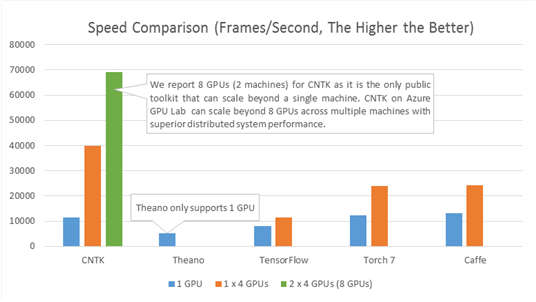

**The [CNTK Wiki](https://github.com/Microsoft/CNTK/wiki) has all information on CNTK including [setup](https://github.com/Microsoft/CNTK/wiki/Setup-CNTK-on-your-machine), [examples](https://github.com/Microsoft/CNTK/wiki/Examples), etc.**  
Give us feedback through these [channels](https://github.com/Microsoft/CNTK/wiki/Feedback-Channels).

# Latest news
***2017-04-21.* CNTK 2.0 Release Candidate 2**  
With Release Candidate 2 we reacted to customer feedback and improved/added features, functionality, and performance.

Highlights:
* New operators like `pow`, `sequence.reduce_max`, `sequence.softmax`.
* New feature for Linux source builds (GPU Direct RDMA support in distributed gradients aggregation, NCCL support for Python in V2 gradients aggregation).
* Support for Python 3.6 for source and binary installation; see [here](https://github.com/Microsoft/CNTK/wiki/Setup-CNTK-on-your-machine).
* `UserMinibatchSource` to write custom minibatch sources; see [here](https://cntk.ai/pythondocs/extend.html#user-defined-minibatch-sources).
* New C# APIs: `class NDArrayView` and methods, `SetMaxNumCPUThreads()`, `GetMaxNumCPUThreads()`, `SetTraceLevel()`, `GetTraceLevel()`
* A new set of NuGet Packages is provided with this Release. 

The [release notes](https://github.com/Microsoft/CNTK/wiki/CNTK_2_0_RC_2_Release_Notes) contain an overview. 
Get the release from the [CNTK Releases Page](https://github.com/Microsoft/CNTK/releases).

***2017-03-31.* V 2.0 Release Candidate 1**  
With Release Candidate 1 the Microsoft Cognitive Toolkit enters the final set of enhancements before release of the production version of CNTK v.2.0. 

Highlights:
* The release candidate contains [all changes and improvements introduced in CNTK 2.0 during beta phase](https://github.com/Microsoft/CNTK/wiki/CNTK-2.0-Beta-Highlights).
* Enables Caffe-converted pretrained models on image classification including AlexNet, ResNet, VGG and BN-Inception. 
* Slice now supports multiple-axis slicing.
* Improves performance and memory footprint
* Improvements in the [device selection API](https://github.com/Microsoft/CNTK/wiki/CNTK_2_0_RC_1_Release_Notes).
* New Python [model debugging functions](https://www.cntk.ai/pythondocs/cntk.debugging.html#module-cntk.debugging.debug).
* Improvements in Python and C# API. See the [release notes](https://github.com/Microsoft/CNTK/wiki/CNTK_2_0_RC_1_Release_Notes) for detailed description.
* New file names for [CNTK libraries and dlls](https://github.com/Microsoft/CNTK/wiki/CNTK-Shared-Libraries-Naming-Format).

The [release notes](https://github.com/Microsoft/CNTK/wiki/CNTK_2_0_RC_1_Release_Notes) contain an overview. 
Get the release from the [CNTK Releases Page](https://github.com/Microsoft/CNTK/releases).

***2017-03-24.* Important Note breaking changes**
There are breaking changes in master compared to beta15, click [here](https://github.com/Microsoft/CNTK/wiki/Breaking-changes-in-Master-compared-to-beta15) for more information.

***2017-03-16.* V 2.0 Beta 15 Release available at Docker Hub**  
CNTK V 2.0 Beta 15 Runtime packages are now available as [Public Images at Docker Hub](https://hub.docker.com/r/microsoft/cntk/).  
See more on CNTK as Docker Images in this [Wiki article](https://github.com/Microsoft/CNTK/wiki/CNTK-Docker-Containers).

***2017-03-15.* V 2.0 Beta 15 Release**  
Highlights of this Release:
* Added support for TensorBoard output in BrainScript. [Read more here](https://github.com/Microsoft/CNTK/wiki/Using-TensorBoard-for-Visualization).
* Learners can now be implemented in pure Python by means of `UserLearners`. [Read more here](https://www.cntk.ai/pythondocs/extend.html#user-learners).
* New debugging helpers: `dump_function()`, `dump_signature()`.
* Tensors can be indexed using advanced indexing. E.g. `x[[0,2,3]]` would return a tensor that contains the first, third and fourth element of the first axis.
* Significant updates in the [Layers Library](https://www.cntk.ai/pythondocs/layerref.html) of Python API. See [Release Notes](https://github.com/Microsoft/CNTK/wiki/CNTK_2_0_beta_15_Release_Notes) for detailed description.
* Updates and [new examples](https://github.com/Microsoft/CNTK/wiki/CNTK-Eval-Examples#examples-for-evaluating-multiple-requests-in-parallel) in C# API.
* Various bug fixes.

See more in the [Release Notes](https://github.com/Microsoft/CNTK/wiki/CNTK_2_0_beta_15_Release_Notes).  
Get the Release from the [CNTK Releases page](https://github.com/Microsoft/CNTK/releases).

***2017-02-28.* V 2.0 Beta 12 Release available at Docker Hub**  
CNTK V 2.0 Beta 12 Runtime packages are now available as [Public Images at Docker Hub](https://hub.docker.com/r/microsoft/cntk/).  
See more on CNTK as Docker Images in this [Wiki article](https://github.com/Microsoft/CNTK/wiki/CNTK-Docker-Containers).

See [all news](https://github.com/Microsoft/CNTK/wiki/News).

# What is The Microsoft Cognitive Toolkit

The Microsoft Cognitive Toolkit (https://www.microsoft.com/en-us/research/product/cognitive-toolkit/), is a unified deep-learning toolkit that describes neural networks as a series of computational steps via a directed graph. In this directed graph, leaf nodes represent input values or network parameters, while other nodes represent matrix operations upon their inputs. CNTK allows to easily realize and combine popular model types such as feed-forward DNNs, convolutional nets (CNNs), and recurrent networks (RNNs/LSTMs). It implements stochastic gradient descent (SGD, error backpropagation) learning with automatic differentiation and parallelization across multiple GPUs and servers. CNTK has been available under an open-source license since April 2015. It is our hope that the community will take advantage of CNTK to share ideas more quickly through the exchange of open source working code.

Wiki: Go to the [CNTK Wiki](https://github.com/Microsoft/CNTK/wiki) for all information on CNTK including [setup](https://github.com/Microsoft/CNTK/wiki/Setup-CNTK-on-your-machine ), [examples](https://github.com/Microsoft/CNTK/wiki/Examples ), etc.

License: See [LICENSE.md](./LICENSE.md) in the root of this repository for the full license information.

Tutorial: [Microsoft Computational Network Toolkit (CNTK) @ NIPS 2015 Workshops](https://research.microsoft.com/en-us/um/people/dongyu/CNTK-Tutorial-NIPS2015.pdf)

Blogs:

* [Microsoft Computational Network Toolkit offers most efficient distributed deep learning computational performance](https://blogs.technet.com/b/inside_microsoft_research/archive/2015/12/07/microsoft-computational-network-toolkit-offers-most-efficient-distributed-deep-learning-computational-performance.aspx)
* [Microsoft researchers win ImageNet computer vision challenge (December 2015)](https://blogs.microsoft.com/next/2015/12/10/microsoft-researchers-win-imagenet-computer-vision-challenge/)

## Performance

Cognitive Toolkit (CNTK) provides significant performance gains compared to other toolkits [click here for details](https://arxiv.org/pdf/1608.07249.pdf). Here is a summary of findings by researchers at HKBU.

> * CNTK’s LSTM performance is 5-10x faster than the other toolkits.
> * For convolution (image tasks), CNTK is comparable, but note the authors were using CNTK 1.7.2, and current CNTK 2.0 beta 10 is over 30% faster than 1.7.2.
> * For all networks, CNTK's performance was superior to TensorFlow performance.

Historically, CNTK has been a pioneer in optimizing performance on multi-GPU systems. We continue to maintain the edge ([NVidia news at SuperComputing 2016](http://nvidianews.nvidia.com/news/nvidia-and-microsoft-accelerate-ai-together) and [CRAY at NIPS 2016](https://www.onmsft.com/news/microsoft-and-cray-announce-partnership-to-speed-up-deep-learning-on-supercomputers)).

 CNTK was a pioneer in introducing scalability across multi-server multi-GPU systems. The figure below compares processing speed (frames processed per second) of CNTK to that of four other well-known toolkits. The configuration uses a fully connected 4-layer neural network (see our benchmark [scripts](https://github.com/Alexey-Kamenev/Benchmarks)) and an effective mini batch size (8192). All results were obtained on the same hardware with the respective latest public software versions as of Dec 3, 2015.

## Citation

If you used this toolkit or part of it to do your research, please cite the work as:

Amit Agarwal, Eldar Akchurin, Chris Basoglu, Guoguo Chen, Scott Cyphers, Jasha Droppo, Adam Eversole, Brian Guenter, Mark Hillebrand, T. Ryan Hoens, Xuedong Huang, Zhiheng Huang, Vladimir Ivanov, Alexey Kamenev, Philipp Kranen, Oleksii Kuchaiev, Wolfgang Manousek, Avner May, Bhaskar Mitra, Olivier Nano, Gaizka Navarro, Alexey Orlov, Hari Parthasarathi, Baolin Peng, Marko Radmilac, Alexey Reznichenko, Frank Seide, Michael L. Seltzer, Malcolm Slaney, Andreas Stolcke, Huaming Wang, Yongqiang Wang, Kaisheng Yao, Dong Yu, Yu Zhang, Geoffrey Zweig (in alphabetical order), ["An Introduction to Computational Networks and the Computational Network Toolkit"](https://research.microsoft.com/apps/pubs/?id=226641), Microsoft Technical Report MSR-TR-2014-112, 2014.

## Disclaimer

CNTK is in active use at Microsoft and constantly evolving. There will be bugs.

## Microsoft Open Source Code of Conduct

This project has adopted the [Microsoft Open Source Code of Conduct](https://opensource.microsoft.com/codeofconduct/). For more information see the [Code of Conduct FAQ](https://opensource.microsoft.com/codeofconduct/faq/) or contact [opencode@microsoft.com](mailto:opencode@microsoft.com) with any additional questions or comments.
