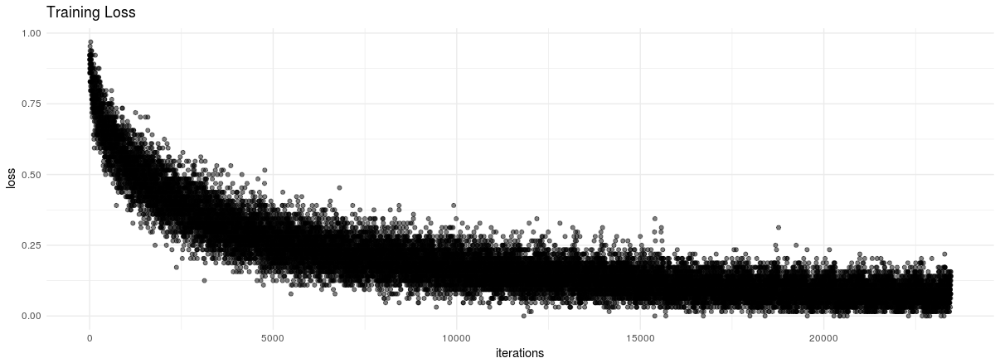

```{r, echo = FALSE, message=FALSE}
Sys.setenv(RETICULATE_PYTHON = "/home/alizaidi/anaconda3/envs/cntk-py35/bin/python")
library(reticulate)
library(cntk)
library(magrittr)
```


## Goals and Overview

In this vignette, we will describe the core functionality of the CNTK framework, and how to use it's R bindings to ingest data, train a model, and evaluate it on a test set. We will train our model using the CIFAR-10 dataset, developed by Alex Krizhevsky while a student at the University of Toronto, and available for download online [here](https://www.cs.toronto.edu/~kriz/cifar.html). A sample of each class is shown in the image below:


## Load CNTK Environment

Before loading the CNTK package, ensure that your `RETICULATE_PYTHON` environment variable is pointing to your Python environment containing CNTK:

```R
Sys.setenv(RETICULATE_PYTHON = "/home/alizaidi/anaconda3/envs/cntk-py35/bin/python")
library(reticulate)
library(cntk)
library(magrittr)
py_module_available("cntk")
[1] TRUE
```

## Feeding Data to CNTK

One of the crucial components in effectively training neural network models is the ability to feed data efficiently. Ideally, data would be fed into the neural network optimizer in mini-batches, [normalized](https://arxiv.org/abs/1502.03167) and within sizes that accomdate as much parallelism as possible while minimizing network and I/O latency. 

CNTK is equipped with an extensible API to read in data from data sources and passed on to training objects and optimization routines as efficiently as possible, even when working with distributed data sources and multiple GPUs/devices. When working with data that is small enough to fit in memory, users can pass `Numpy/SciPy` arrays/CSR matrices directly to CNTK. When working with R, users can also pass R arrays and matrices to CNTK, but that will incur an additional performance penalty due differences in the underlying data structures of `Numpy` objects and R arrays. 

The preferred method, especially when working with data that is larger than the client's memory (in this case, the R process), is to use the built-in `MinibatchSource` class in CNTK. This class has pre-built methods for reading in data with a multitude of highly useful parameters for configuring mini-batch ingestion of data in neural network architectures. 

In this example, we will look at the CNTK `CTFDeserializer` function for reading in data using the **CNTK text format (CTF)**, which is an efficient format for storing data for CNTK.

First you should download the CIFAR-10 dataset. In this vignette, we will download the data to a location in the _Examples/Image/DataSets/CIFAR-10_ directory. This directory ships with the CNTK package, and includes a convenient Python script for downloading the CIFAR-10 data.

To execute the script, follow the instructions [here](https://github.com/Microsoft/CNTK/tree/master/Examples/Image/DataSets/CIFAR-10). 

If you examine the data directory, you'll see there are a few data files now populated. In particular, there is a file called `Train_cntk_text.txt` and `Test_cntk_text.txt`. If you peek at the format of these files, you'll see that they are stored in a dense string format:

```bash
alizaidi@azvm:CNTK/Examples/Image/DataSets/CIFAR-10$ head Train_cntk_text.txt -n 1
|labels 0 0 0 0 0 0 1 0 0 0 |features 59 43 50 68 98 119 139 145 149 149 131 125 142 144 137 129 137 134 124 139 139 133 136 139 152 163 168 159 158 158 152 148 16 0 18 51 88 120 128 127 126 116 106 101 105 113 109 112 119 109 105 125 127 122 131 124 121 131 132 133 133 1 (omitted)...
```

The data is represented in a long string, with the labels represented using a one-hot representation and the features as a long string of pixel values of the image.

## Define Minibatch Reader Functions

Our first step is to define a function for reading in minibatches. We will define a function named `create_reader` which will be our entry point into the text dataset for training and evaluation. The function relies on CNTK's text-format-reader, `CTFDeserializer` to read in the text data you imported earlier. The `CTFDeserializer` function takes two arguments, first argument is the path of the data you want to import, and the second is a dictionary mapping stream names to `StreamDef` objects. In our case, the stream names are the `features` and `labels` respectively. For training, we have the ability to make multiple random passes through our data, which can greatly improve training performance, while for evaluation we will make a single deterministic pass-through.

```{r}
create_reader <- function(path, is_training, input_dim, label_dim) {
    MinibatchSource(CTFDeserializer(path, StreamDefs(
        features = StreamDef(field = "features", shape = input_dim),
        labels = StreamDef(field = "labels", shape = label_dim)
    )), randomize = is_training, max_sweeps = ifelse(is_training, IO_INFINITELY_REPEAT, 1))
}
```

## Defining the Network Architecture

Now that we have our function to feed data into our network, let's define the parameters of our network architecture. The reader function itself needs the path to the data, `input` features dimension and `output` labels dimensions, but we also need to define training parameters such as epoch size and minibatch size. The CIFAR-10 dataset consists of 60000 32x32 colour images in 10 classes, with 6000 images per class, so we can define the `input_dim` by multiplying the pixel rate by the number of channels (three). 

```{r}
# ensure the path leads to the data where you have saved the CIFAR-10 images
data_path <- file.path("../../../",
                       "Examples", "Image", "DataSets", "CIFAR-10")
if (!(file.exists(data_path))) message("Ensure your data_path is correct!")
epoch_size <- 50000
minibatch_size <- 64
max_epochs <- 30
image_height <- 32
image_width <- 32
num_channels <- 3
input_dim <- image_height * image_width * num_channels
num_output_classes <- 10
```

Next, we define the input variables denoting the features and label data:

```{r}
input_var <- op_input_variable(c(num_channels, image_height, image_width), 
                               name = "input")
label_var <- op_input_variable(num_output_classes, 
                               name = "label")
```

We will also normalize the input variables:

```{r}
input_remove_mean <- op_minus(input_var, op_constant(128))
normalized_input <- op_element_times(op_constant(0.00390625), input_remove_mean)
```

Now we are ready to define our network architecture. The functions we use are all part of the CNTK [Layers](https://www.cntk.ai/pythondocs/layerref.html) library. Please refer to those Python docs for a complete reference about these functions.

In our case, we are going to define a convolutional neural network with four convolutional layers and two max-pooling layers. 


```{r}
z <- Sequential(
    For(1:2, function() { 
        c(
            Convolution2D(c(3, 3), 64, op_relu, pad = TRUE),
            Convolution2D(c(3, 3), 64, op_relu, pad = TRUE),
            MaxPooling(c(3, 3), c(2, 2), pad = TRUE)
        )
    }),
    Dense(256, op_relu),
    Dropout(0.5),
    Dense(128, op_relu),
    Dropout(0.5),
    Dense(num_output_classes, activation = NULL)
)(normalized_input)
```

### Visualize Network

We can visualize this network using the SVG display:

```{r, fig.height=14, fig.width=7}
visualize_network(z)
```

## Training

Now we are ready to train our network. To do so, we first define the loss function. As is typical for image classification tasks, we will use a cross-entropy softmax loss function, and our evaluation metric will be the classification error.

```{r, eval = FALSE}
loss <- loss_cross_entropy_with_softmax(z, label_var)
metric <- classification_error(z, label_var)
```

We will create a pointer to our training dataset:

```{r, eval = FALSE}
reader_train <- create_reader(file.path(data_path, 'Train_cntk_text.txt'), 
                              TRUE, input_dim, num_output_classes)
```


For optimization, we will use the minibatch SGD with momentum, for which we'll define a learning rate and momentum schedules. We'll also add $\ell_1$ and $\ell_2$ regularization penalty on each minibatch sample to increase regularization.

```{r, eval = FALSE}
lr_per_sample <- c(rep(c(0.0015625), 10), rep(c(0.00046875), 10), 0.00015625)
lr_schedule <- learning_rate_schedule(0.001, UnitType('sample'), epoch_size)
mm_time_constant <- c(rep(0, 20), -minibatch_size / log(0.9))
mm_schedule <- momentum_as_time_constant_schedule(mm_time_constant, epoch_size)
l2_reg_weight <- 0.002
```

We can now define our training algorithm:

```{r, eval = FALSE}
learner <- learner_momentum_sgd(z$parameters, lr_schedule, mm_schedule,
                                l2_regularization_weight = l2_reg_weight)
progress_printer <- ProgressPrinter(tag = 'Training', num_epochs = max_epochs)
trainer <- Trainer(z, c(loss, metric), learner, progress_printer)

```

Create mapping from features to data:

```{r, eval = FALSE}
input_map = list(
  "input" = reader_train$streams$features,
  "label" = reader_train$streams$labels
)
```

We now define a loop over which to train our network's weights. To do so, at each minibatch we iterate over our MinibatchSource and test our evaluation function `test_minibatch` over each minibatch of data. Upon evaluation, we can backpropagate and update our model parameters using the `train_minibatch` function.

```{r, eval = FALSE}
loss_over_time <- c()
for (epoch in 1:max_epochs) {
    sample_count <- 0
    while (sample_count < epoch_size) {
        current_minibatch <- min(minibatch_size, epoch_size - sample_count)
        data <- reader_train %>% next_minibatch(current_minibatch, input_map = input_map)
        result <- trainer %>% test_minibatch(data)
        loss_over_time <- c(loss_over_time, result)
        trainer %>% train_minibatch(data)
        sample_count <- sample_count + trainer$previous_minibatch_sample_count
    }
    summarize_training_progress(trainer)
}

```

We can visualize our training loss:

```{r, eval = FALSE}
library(ggplot2)
ggplot(data.frame(loss = loss_over_time, 
                  iterations = 1:length(loss_over_time))) + 
  geom_point(aes(x = iterations, y = loss), alpha = 0.5) + theme_minimal() +
  labs(title = "Training Loss")
```



## Evaluation

Now that we have our trained model, we can evaluate it on our test set. We will again call on our `create_reader` function, but this time point to the **Test** CTF file, and we also specify the input dictionary.

```{r, eval = FALSE}
reader_test <- create_reader(path = file.path(data_path, 'Test_cntk_text.txt'),
                             is_training =  FALSE,
                             input_dim, num_output_classes)
input_map <- list(
    "input" = reader_test$streams$features,
    "label" = reader_test$streams$labels
)
```

We can setup our evaluation parameters:

```{r, eval = FALSE}
epoch_size <- 2000
minibatch_size <- 200
metric_numer <- 0
metric_denom <- 0
sample_count <- 0
minibatch_index <- 0
```

And evaluate:

```{r, eval = FALSE}

test_loss <- c()
while (sample_count < epoch_size) {
    current_minibatch <- min(minibatch_size, epoch_size - sample_count)
    data <- reader_test %>% next_minibatch(current_minibatch, input_map = input_map)
    metric_numer <-  metric_numer + trainer %>% test_minibatch(data) * current_minibatch
    metric_denom <-  metric_denom + current_minibatch
    sample_count <-  sample_count + data$label$num_samples
    minibatch_index = minibatch_index + 1
}

sprintf("Final error: %g%%", metric_numer / metric_denom * 100)
[1] "Final error: 21.25%"
```

