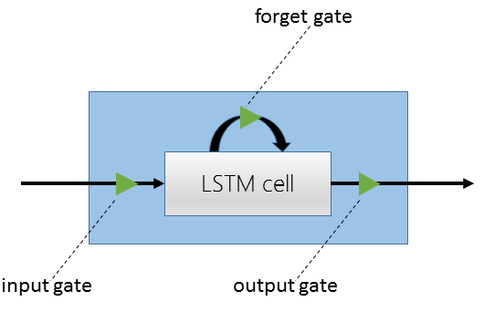

Getting started
===============

Installation
------------
This page will guide you through the following three required steps:

#. Make sure that all Python requirements are met
#. Install CNTK2

Requirements
~~~~~~~~~~~~
You will need the following Python packages: 

:Python: 3.4
:NumPy: >= 1.11
:Scipy: >= 0.17

On Linux a simple ``pip install`` should suffice. On Windows, you will get
everything you need from `Anaconda <https://www.continuum.io/downloads>`_.

CNTK also depends on Open MPI (`Linux <https://github.com/Microsoft/CNTK/wiki/Setup-CNTK-on-Linux#open-mpi>`_ and `Windows <>`_) and 
`CUDA <https://developer.nvidia.com/cuda-downloads>`_. Please see the Wiki for more information.

Installing CNTK
~~~~~~~~~~~~~~~
Installing CNTK for Python is now easy. Simply run ``pip install http://atleneu04.guest.corp.microsoft.com:8000/cntk-2.0a2-cp34-cp34m-linux_x86_64.whl``. 
You can then start using CNTK from Python right away:

    >>> import cntk
    >>> cntk.__version__
    '2.0'
    
    >>> cntk.minus([1, 2, 3], [4, 5, 6]).eval()
    array([-3., -3., -3.], dtype=float32)

The above makes use of the CNTK ``minus`` node with two array constants. Every operator has an ``eval()`` method that can be called which runs a forward 
pass for that node using its inputs, and returns the result of the forward pass. A slightly more interesting example that uses input variables (the 
more common case) is as follows:

    >>> i1 = cntk.input_variable((1, 2))
    >>> i2 = cntk.input_variable((1, 2))
    >>> cntk.squared_error(i1, i2).eval({i1:np.asarray([[[[2., 1.]]]], dtype=np.float32),  i2:np.asarray([[[[4., 6.]]]], dtype=np.float32)})
    array(29.0, dtype=float32)

In the above example we are first setting up two input variables with shape ``(1, 2)``. We then setup a ``squared_error`` node with those two variables as 
inputs. Within the ``eval()`` method we can setup the input-mapping of the data for those two variables. In this case we pass in two numpy arrays. The squared 
error is then of course ``(2-4)**2 + (1-6)**2 = 29``.

Overview and first run
----------------------

CNTK2 is a major overhaul of CNTK in that one now has full control over the data and how its read in, the training and testing loops, and minibatch 
construction. The Python bindings provide direct access to the created network graph, and data can be manipulated outside of the readers not only 
for more powerful and complex networks, but also for interactive Python sessions while a model is being created and debugged.

CNTK2 also includes a number of ready-to-extend examples and a layers library. The latter allows one to simply build a powerful deep network by 
snapping together levels of convolution layers, recurrent neural net layers (LSTMs, etc.), and fully-connected layers. To begin, we will take a 
look at a classical feedforward classification model in our first basic use.

First basic use
~~~~~~~~~~~~~~~

The first step in training or running a network in CNTK is to decide which device it should be run on. If you have access to a GPU, training time 
can be vastly improved. To explicitly set the device to GPU, set the target device as follows:

    >>> target_device = DeviceDescriptor.gpu_device(0)
    >>> DeviceDescriptor.set_default_device(target_device)

Now let's setup a network that will learn a classifier based on the example fully connected classifier network 
(``examples.common.nn.fully_connected_classifier_net``). This is a simple task and looks like this:

```
    def fully_connected_classifier_net(input, num_output_classes, hidden_layer_dim, num_hidden_layers, nonlinearity):
        r = fully_connected_layer(input, hidden_layer_dim, nonlinearity)
        for i in range(1, num_hidden_layers):
            r = fully_connected_layer(r, hidden_layer_dim, nonlinearity)
        return linear_layer(r, num_output_classes)
```


Now that we've seen some of the basics of setting up and training a network using the CNTK Python API, 
let's look at a more interesting deep learning problem in more detail.


Sequence classification
~~~~~~~~~~~~~~~~~~~~~~~

One of the most exciting areas in deep learning is the powerful idea of recurrent 
neural networks (RNNs). RNNs are in some ways the Hidden Markov Models of the deep 
learning world. They are networks with loops in them and they allow us to model the 
current state given the result of a previous state. In other words, they allow information 
to persist. So, while a traditional neural network layer can be thought of as having data 
flow through as in the figure on the left below, an RNN layer can be seen as the figure 
on the right.

.. figure:: images/nn_layers.png
    :width: 600px
    :alt: NN Layers

As is apparent from the figure above on the right, RNNs are the natural structure for 
dealing with sequences. This includes everything from text to music to video; anything 
where the current state is dependent on the previous state. While RNNs are indeed 
powerful, the "vanilla" RNN suffers from an important problem: long-term dependencies. 
Because the gradient needs to flow back through the network to learn, the contribution 
from an early element (for example a word at the start of a sentence) on a much later 
elements (like the last word) can essentially vanish.

To deal with the above problem, we turn to the Long Short Term Memory (LSTM) network. 
LSTMs are a type of RNN that are exceedingly useful and in practice are what we commonly 
use when implementing an RNN. For more on why LSTMs are so powerful, see, e.g. 
http://colah.github.io/posts/2015-08-Understanding-LSTMs. For our purposes, we will 
concentrate on the central feature of the LSTM model: the `memory cell`. 



    An LSTM cell.

The LSTM cell is associated with three gates that control how information is stored / 
remembered in the LSTM. The "forget gate" determines what information should be kept 
after a single element has flowed through the network. It makes this determination 
using data for the current time step and the previous hidden state. 

The "input gate" uses the same information as the forget gate, but passes it through 
a `tanh` to determine what to add to the state. The final gate is the "output gate" 
and it modulates what information should be output from the LSTM cell. This time we 
also take the previous state's value into account in addition to the previous hidden 
state and the data of the current state. We have purposely left the full details out 
for conciseness, so please see the link above for a full understanding of how an LSTM 
works.

In our example, we will be using an LSTM to do sequence classification. But for even 
better results, we will also introduce an additional concept here: 
`word embeddings <https://en.wikipedia.org/wiki/Word_embedding>`_. 
In traditional NLP approaches, words are seen as single points in a high dimensional 
space (the vocabulary). A word is represented by an arbitrary id and that single number 
contains no information about the meaning of the word or how it is used. However, with 
word embeddings each word is represented by a learned vector that has some meaning. For 
example, the vector representing the word "cat" may somehow be close, in some sense, to 
the vector for "dog", and each dimension is encoding some similarities or differences 
between those words that were learned usually by analyzing a large corpus. In our task, 
we will use a pre-computed word embedding model (e.g. from `GloVe <http://nlp.stanford.edu/projects/glove/>`_) 
and each of the words in the sequences will be replaced by their respective GloVe vector.

Now that we've decided on our word representation and the type of recurrent neural 
network we want to use, let's define the computational network that we'll use to do 
sequence classification. We can think of the network as adding a series of layers:

1. Embedding layer (individual words in each sequence become vectors)
2. LSTM layer (allow each word to depend on previous words)
3. Softmax layer (an additional set of parameters and output probabilities per class)

We can define this network as follows in the CNTK Python API::

    import cntk as C

    def seqcla():
    # model
    num_labels = 5
    vocab = 2000
    embed_dim = 50

    # LSTM params
    input_dim = 50
    output_dim = 128
    cell_dim = 128

    t = C.dynamic_axis(name='t')
    # temporarily using cntk1 SparseInput because cntk2's input() will simply allow sparse as a parameter
    features = cntk1.SparseInput(vocab, dynamicAxis=t, name='features')
    labels = C.input(num_labels, name='labels')

    train_reader = C.CNTKTextFormatReader(train_file)

    # setup embedding matrix
    embedding = C.parameter((embed_dim, vocab),
                             learning_rate_multiplier=0.0,
                             init_from_file_path=embedding_file)

    # get the vector representing the word
    sequence = C.times(embedding, features, name='sequence')

    # add an LSTM layer
    L = lstm_layer(output_dim, cell_dim, sequence, input_dim)

    # add a dense layer on top
    w = C.parameter((num_labels, output_dim), name='w')
    b = C.parameter((num_labels), name='b')
    z = C.plus(C.times(w, L), b, name='z')
    z.tag = "output"

    # and reconcile the shared dynamic axis
    pred = C.reconcile_dynamic_axis(z, labels, name='pred')

    ce = C.cross_entropy_with_softmax(labels, pred)
    ce.tag = "criterion"


Let's go through some of the intricacies of the above network definition. First, we define 
some parameters of the data and the network. We have 5 possible classes for the sequences; 
we're working with a vocabulary of 2000 words; and our embedding vectors have a dimension of 
50. Because the word vectors are input to the LSTM, the `input_dim` of the LSTM is also 50. 
We can, however, output any dimension from the LSTM; our `cell_dim` and `output_dim` are the 
same and we output 128-dimensional tensors.

We then set up our training data. First, we create a dynamic axis. The dynamic axis is a key 
concept in CNTK that allows us to work with sequences without having to pad our data when we 
have sequences of different lengths (which is almost always the case). We then set up our 
features by defining a `SparseInput`. In this release, :func:`cntk.ops.input` only supports dense features 
so we have to use the legacy `cntk1.SparseInput` until 1.5. Each word has a dimension of size 
`vocab` and we attach the dynamic axis `t` that we created just above. Then we set up our labels 
using the standard :func:`cntk.ops.input` where the dimension is of size `num_labels`.

Our final piece of setup before beginning to define the network is creating a `reader` for our 
training data. We use the :class:`cntk.reader.CNTKTextFormatReader` and pass in the name of our 
training data file.

Now we can start defining our network. The first layer is the word embedding. We define this 
using a `parameter` of shape `(embed_dim, vocab)` that is initialized from a file where our 
embedding matrix is stored. We set the `learning_rate_multiplier` parameter to 0.0 so that this 
is treated as a constant.

To view the input data words as vectors, we multiply the embedding matrix with the one-hot vector 
words which results in the data being represented by vectors. An LSTM layer is then added which 
returns the last hidden state of the unrolled network. We then add the dense layer followed by 
the criterion node that adds a softmax and then implements the cross entropy loss function. Before 
we add the criterion node, however, we call :func:`cntk.ops.reconcile_dynamic_axis` which will ensure 
that the minibatch layout for the labels and the data with dynamic axes is compatible.

For the full explanation of how ``lstm_layer()`` is defined, please see the full example
(`seqcla.py <https://github.com/Microsoft/CNTK/blob/master/contrib/Python/cntk/examples/LSTM/seqcla.py>`_) in the
Examples section.

How to pass Python data as train/test data
~~~~~~~~~~~~~~~~~~~~~~~~~~~~~~~~~~~~~~~~~~

The Python CNTK API allows to pass training / testing data either by specifying external input files
or by using Python data directly to CNTK.This second alternative - using internal Python data - is useful
especially if you want to do some quick experimentation with small synthetic data sets. In what follows you
will learn in what structure these data has to be provided.

Let us start with a scenario coming from one of our code examples
(`logreg_numpy.py <https://github.com/Microsoft/CNTK/tree/master/contrib/Python/cntk/examples/LogReg/logreg_numpy.py>`_).
In this example we want to classify a 250 dimensional feature vector into one of two classes. In this case we have two *inputs*:
 - The features values for each training item. In the example these are 500 vectors each of dimension 250. 
 - The expected class. In this example the class is encoded with a two-dimensional vector where the element
   for expected class is set to 1 and the other to 0.

For each of these inputs we have to provide one data structure containing all training instances. 

You might notice that this is conceptually different to the case where we provide the data from external files using the CNTKTextReader. 
In the input file for CNTKTextReader we provide data for different *inputs* of one instance on the same line, so
the data from different inputs are much more intertwined.

In Python the feature data are represented by a NumPy array of dimension ``number_of_instances X dimension_of_feature_space``
so in out example its a NumPy array of dimension ``500 X 250``.
Likewise the expected output is represented by another NumPy array of dimension ``500 X 2``.

Passing sequence data from Python
~~~~~~~~~~~~~~~~~~~~~~~~~~~~~~~~~

CNTK can handle sequences with arbitrary maximal length. This feature is also called *dynamic-axis*.
To represent an input with a dynamic-axis in Python you have to provide each sequence as a NumPy-array where
the first axis has a dimension equal to the sequence length.
The complete dataset is then just a normal one-dimensional NumPy array of these sequences.

Take as an artificial example a sentence classification problem. Each sentence has a different number of
words, i.e. it is a *sequence* of words. The individual words might each be represented by some latent vector.
So each sentence is represented by a NumPy array of dimension ``sequence_length X embedding_dimension``. The
whole set of instances (sentences) is then represented by putting them into a one-dimensional array with the
size equal to the number of instances.

 
