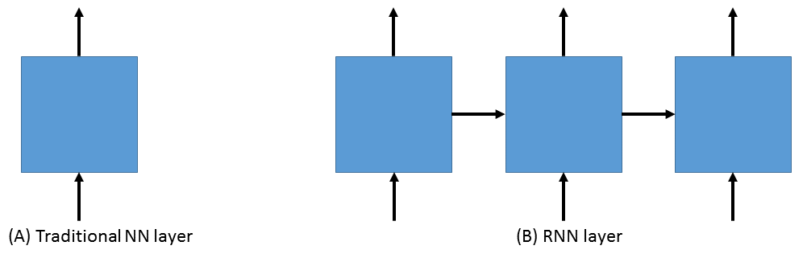

Working with Sequences
======================

CNTK Concepts
~~~~~~~~~~~~~

CNTK inputs, outputs and parameters are organized as *tensors*. Each tensor has a *rank*:
A scalar is a tensor of rank 0, a vector is a tensor of rank 1, a matrix is a tensor 
of rank 2, and so on. We refer to these different dimensions as *axes*.

Every CNTK tensor has some *static axes* and some *dynamic axes*.
The static axes have the same length throughout the life of the network.
The dynamic axes are like static axes in that they define a meaningful grouping of the numbers contained in the tensor but:

 - their length can vary from instance to instance
 - their length is typically not known before each minibatch is presented
 - they may be ordered

A minibatch is also a tensor. Therefore, it has a dynamic axis, called the *batch axis*,
whose length can change from minibatch to minibatch. At the time of this writing 
CNTK supports a single additional dynamic axis. It is sometimes referred to as the sequence 
axis but it doesn't have a dedicated name. This axis enables working with
sequences in a high-level way. When operations on sequences are performed, CNTK
does a simple type-checking to determine if combining two sequences is always safe.

To make this more concrete, let's consider two examples. First, let's see
how a minibatch of short video clips is represented in CNTK. 
Suppose that the video clips are all 640x480 in 
resolution and they are shot in color which is typically encoded with three channels.
This means that our minibatch has three static axes of length 640, 480, and 3 respectively. 
It also has two dynamic axes:
the length of the video and the minibatch axis. So a minibatch of 16 videos each
of which is 240 frames long would be represented as a 16 x 240 x 3 x 640 x 480
tensor. 

Another example where dynamic axes provide an elegant solution is in learning to rank documents
given a query. Typically, the training data in this scenario consist of a set of 
queries, with each query having a variable number of associated documents. Each of the query-document
pairs includes a relevance judgment or label (e.g. whether the document is relevant for that query
or not). Now depending on how we treat the words in each document we can either place
them on a static axis or a dynamic axis. To place them on a static axis we can process
each document as a (sparse) vector of size equal to the size of our vocabulary
containing for each word (or short phrase) the number of times it appears in the
document. However we can also process the document to be a sequence of words
in which case we use another dynamic axis. In this case we have the following nesting:

 - Query: CNTK

   - Document 1:

     - Microsoft
     - Cognitive
     - Toolkit

   - Document 2:

     - Cartoon
     - Network

   - Document 3:

     - NVIDIA
     - Microsoft
     - Accelerate
     - AI

 - Query: flower

   - Document 1:

     - Flower
     - Wikipedia

   - Document 2:

     - Local 
     - Florist
     - Flower
     - Delivery

The outermost level is the batch axis. The document level should have 
a dynamic axis because we have a variable number of candidate documents per query. 
The innermost level should also have a dynamic axis because each document 
has a variable number of words. The tensor describing this minibatch will also
have one or more static axes, describing features such as the identity of the words in
the query and the document. With rich enough training data it is possible to have
another level of nesting, namely a session, in which multiple related queries belong
to.

Sequence classification
~~~~~~~~~~~~~~~~~~~~~~~

One of the most exciting areas in deep learning is the powerful idea of recurrent 
neural networks (RNNs). RNNs are in some ways the Hidden Markov Models of the deep 
learning world. They are networks that process variable length sequences using 
a fixed set of parameters. Therefore they have to learn to summarize all the
observations in the input sequence into a finite dimensional state, predict the
next observation using that state and transform their current state and the observed
input into their next state. In other words, they allow information 
to persist. So, while a traditional neural network layer can be thought of as having data 
flow through as in the figure on the left below, an RNN layer can be seen as the figure 
on the right.

As is apparent from the figure above on the right, RNNs are the natural structure for 
dealing with sequences. This includes everything from text to music to video; anything 
where the current state is dependent on the previous state. While RNNs are indeed 
powerful, a "vanilla" RNN, whose state at each step is a nonlinear function of
the previous state and the current observation, is extremely hard to learn via gradient based methods.
Because the gradient needs to flow back through the network to learn, the contribution 
from an early element (for example a word at the start of a sentence) on much later 
elements, such as the classification of the last word in a long sentence, can essentially vanish.

Dealing with the above problem is an active area of research. An architecture that
seems to be successful in practice is the Long Short Term Memory (LSTM) network. 
LSTMs are a type of RNN that are exceedingly useful and in practice are what we commonly 
use when implementing an RNN. A good explanation of the merits of LSTMs is at 
http://colah.github.io/posts/2015-08-Understanding-LSTMs. An LSTM is a 
differentiable function that takes an input and a state and produces an output
and a new state.

In our example, we will be using an LSTM to do sequence classification. But for even 
better results, we will also introduce an additional concept here: 
`word embeddings <https://en.wikipedia.org/wiki/Word_embedding>`_. 
In traditional NLP approaches, words are identified with the standard basis of a high 
dimensional space: The first word is (1, 0, 0, ...), the second one 
is (0, 1, 0, ...) and so on (also known as one-hot encoding).  
Each word is orthogonal to all others. But that is not 
a good abstraction.  In real languages, some words are very similar (we call them 
synonyms) or they function in similar ways (e.g. Paris, Seattle, Tokyo). The key 
observation is that words that appear in similar contexts should be similar. We
can let a neural network sort out these details by forcing each word to be represented 
by a short learned vector.  Then in order for the network to do well on its task it 
has to learn to map the words to these vectors effectively. For example, the vector 
representing the word "cat" may somehow be close, in some sense, to the vector for "dog". 
In our task we will learn these word embeddings from scratch. However, it is also 
possible to initialize with a pre-computed word embedding such as 
`GloVe <https://nlp.stanford.edu/projects/glove/>`_ which has been trained on 
corpora containing billions of words. 

Now that we've decided on our word representation and the type of recurrent neural 
network we want to use, let's define the network that we'll use to do 
sequence classification. We can think of the network as adding a series of layers:

1. Embedding layer (individual words in each sequence become vectors)
2. LSTM layer (allow each word to depend on previous words)
3. Softmax layer (an additional set of parameters and output probabilities per class)

A very similar network is also located at ``Examples/SequenceClassification/SimpleExample/Python/SequenceClassification.py``. 
Let's see how easy it is to work with sequences in CNTK:

.. literalinclude:: simplernn.py

Running this script should generate this output::

 average      since    average      since      examples
    loss       last     metric       last
 ------------------------------------------------------
     1.61       1.61      0.886      0.886            44
     1.61        1.6      0.714      0.629           133
      1.6       1.59       0.56      0.448           316
     1.57       1.55      0.479       0.41           682
     1.53        1.5      0.464      0.449          1379
     1.46        1.4      0.453      0.441          2813
     1.37       1.28       0.45      0.447          5679
      1.3       1.23      0.448      0.447         11365
 error: 0.333333

Let's go through some of the intricacies of the network definition above. As usual, we first set the parameters of our model. In this case we
have a vocabulary (input dimension) of 2000, LSTM hidden and cell dimensions of 25, an embedding layer with dimension 50, and we have 5 possible
classes for our sequences. As before, we define two input variables: one for the features, and for the labels. We then instantiate our model. The
``LSTM_sequence_classifier_net`` is a simple function which looks up our input in an embedding matrix and returns the embedded representation, puts
that input through an LSTM recurrent neural network layer, and returns a fixed-size output from the LSTM by selecting the last hidden state of the
LSTM::

    embedded_inputs = embedding(input, embedding_dim)
    lstm_outputs = simple_lstm(embedded_inputs, LSTM_dim, cell_dim)[0]
    thought_vector = sequence.last(lstm_outputs)
    return linear_layer(thought_vector, num_output_classes)

That is the entire network definition. In the second line above we select the first output from the LSTM. In
this implementation of the LSTM this is the actual output while the second output is the state of the LSTM.
We now simply set up our criterion nodes (such as how well we classify the labels using the thought vector) 
and our training loop. In the above example we use a minibatch
size of 200 and use basic SGD with the default parameters and a small learning rate of 0.0005. This results in a powerful state-of-the-art model for 
sequence classification that can scale with huge amounts of training data. Note that as your training data size grows, you should give more capacity to 
the LSTM by increasing the number of hidden dimensions. Further, one can get an even more complex network by stacking layers of LSTMs. Conceptually,
stacking LSTM layers is similar to stacking layers in a feedforward net. Selecting a good architecture however is very task-specific.

Feeding Sequences with NumPy
~~~~~~~~~~~~~~~~~~~~~~~~~~~~

While CNTK has very efficient built-in readers that take care of many details for you
(randomization, prefetching, reduced memory usage, etc.) sometimes your data is already
in numpy arrays. Therefore it is important to know how to specify a sequence of inputs
and how to specify a minibatch of sequences. 

We have discussed text at length so far, so let's switch gears and do 
an example with images. Feeding text data via NumPy arrays is not very different.

Each sequence must be its own NumPy array. Therefore if you have an input variable 
that represents a small color image like this::

    x = sequence.input((3,32,32))

and you want to feed a sequence of 4 images `img1` to `img4`, to CNTK then
you need to create a tensor containing all 4 images. For example::
    
    img_seq = np.stack([img1, img2, img3, img4])
    output = network.eval({x:[img_seq]})

The stack function in NumPy stacks the inputs along a new axis (placing it in the beginning by default)
so the shape of `img_seq` is :math:`4 \times 3 \times 32 \times 32`. You 
might have noticed that before binding `img_seq` to  `x` we wrap it in a list.
This list denotes a minibatch of 1 and **minibatches 
are specified as lists**. The reason for this is because different elements of 
the minibatch can have different lengths. If all the elements in the 
minibatch are sequences of the same length then it is acceptable to provide
the minibatch as one big tensor of dimension :math:`b \times s \times d_1 \times \ldots \times d_k`
where `b` is the batch size, `s` is the sequence length and :math:`d_i`
is the dimension of the i-th static axis of the input variable.
