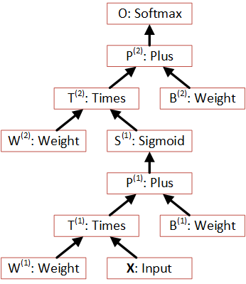
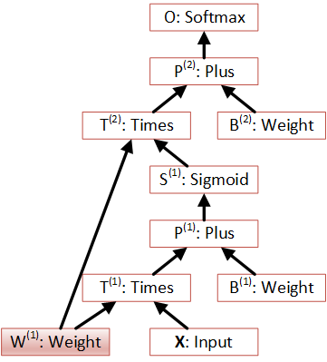
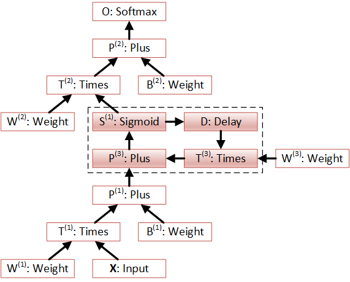

Concepts
========

There is a common property in key machine learning models, such as deep neural
networks (DNNs), convolutional neural networks (CNNs), and recurrent neural 
networks (RNNs). All these models can be described as *computational networks*.

The directed edges of these *cómputational networks* are vectors, matrices, or in general n-dimensional 
arrays (tensors) which represent input data and model parameters. The vertices 
are *functions* (also called operations) that are performing a computation on 
these input tensors. 

Tensors
-------

The underlying data structure in CNTK is that of a *tensor*. It is a 
multidimensional array on which computations can be performed. Every dimension in 
these arrays is referred to as an *axis* to distinguish it from the scalar size 
of every axis. So, a matrix has two *axes* which have both a certain 
*dimension* corresponding to the number of rows and clumns of the *axes*. 

Using tensors makes the framework generic in that it can be used e.g. for 
classification problems where the inputs are vectors, black-and-white 
images (input is a matrix of points), color images (includes a separate dimension 
for r, g, and b) or videos (has an extra time dimension). 

- Tensors have a *shape* which describes the dimensions of its axes. E.g. a shape ``[2,3,4]`` 
  would refer to a tensor with three axes that have, respectively, 2, 3, and 4 
  dimensions. 

- CNTK allows for the last axis to be a *dynamic axis*, i.e. an axis whose size 
  might vary between input samples. This allows for easily 
  modelling sequences (for recurrent networks) without needing to introduce masks 
  or padding. See below for a detailed explanation.

- All data inside of a tensor is of a certain data type. Right now, CNTK 
  implements *float* (32 bit) and *double* (64 bit) precision floating point types, 
  and all tensors in a network have the same type.

- Tensors come either in *dense* or *sparse* form. Sparse tensors should be used
  whenever the bulk of its values are 0. The Python API currently doesn't expose
  sparse tensors; This will be added in the next release.

  
Usages of Tensors
~~~~~~~~~~~~~~~~~

Tensors are introduced in CNTK in one of three places:

- **Inputs**: These represent data inputs to the computation which are usually 
  bound to a data reader. Data inputs are organized as (mini) batches and 
  therefore receive an extra minibatch dimension. In addition, inputs can have a 
  "ragged" axis called "dynamic axis" which is used to model sequential data. See 
  below for details.

- **Parameters**: Parameters are weight tensors that make up the bulk of the 
  actual model. Parameters are initialized using a constant (e.g. all 0's, randomly 
  generated data, or initialized from a file) and are updated during 
  *backpropagation* in a training run.

- **Constants**: Constants are very similar to parameters, but they are not 
  taking part in backpropagation.

All of these represent the *leaf nodes* in the network, or, in other words, the 
input parameters of the function that the network represents.

Broadcasting
~~~~~~~~~~~~

For operations that require the tensor dimensions of their arguments to match, 
*broadcasting*  is applied automatically whenever a tensor dimension is 1. 
Examples are elementwise product or plus operations.
E.g. the following are equivalent:

>>> [2,3] * 2
  [4,6]
>>> [2,3] * [2,2]
  [4,6]
  
  
A Note On Tensor Indices
~~~~~~~~~~~~~~~~~~~~~~~~

Multi-dimensional arrays are often mapped to linear memory in a continous manner.
There is some freedom in which order to map the array elements.
Two typical mappings are *row-major order* and *column-major order*.

For two dimensional arrays (matrices) consecutive elements of the rows of the array are contiguous in memory; in column-major order, 
consecutive elements of the columns are contiguous.

For example the matrix

+--+--+
| 1| 2|
+--+--+
| 3| 4|
+--+--+
| 5| 6|
+--+--+

is linearized as [1, 2, 3, 4, 5, 6] using row-major order, but as [1, 3, 5, 2, 4, 6] using column-major order.

In many programming languages like C, or C# row-major order is used. The same is true for the Python library NumPy (at least by default).
CNTK however uses column-major order.

There are two circumstances where you have to be aware of this ordering:

- When preparing input-files for CNTK. The values have to be provided in column-major order.
- When changing the shape of a tensor. 

This concept extends to arrays of higher dimensions, see `<https://en.wikipedia.org/wiki/Row-major_order>`_

    
Computational Networks
----------------------

Once the input tensors are defined, CNTK allows for building up descriptions of 
the computations that are applied to it. These are translated into computational networks that describe the
data flow as the data are transformed from input (leaf nodes) through computations, to one or 
more output (root) nodes.

The Python api allows to specify such a computational network. For example, a one-hidden-layer sigmoid neural network can be described like shown below::

    from cntk import *
    # X is a data input, W1, W2, B are parameters
    def one_hidden_layer_nn(X, W1, W2, B1, B2):
       T1 = W1 @ X      # Connect hidden layer T1 to input X through weight matrix W1
       P1 = T1 + B1     # Add bias term B1
       S1 = sigmoid(P1) # Elementwise sigmoid function
       T2 = W2 @ S1     # Second layer weight matrix
       P2 = T2 + B2     # Each column of B2 is the bias b2
       O = softmax(P2)  # Apply softmax column-wise to get output O
       return O
   
   
The function above is written using the Python API. It uses "@" as the infix 
matrix multiplication operator, which has been introduced in Python 3.5. For 
previous Python versions, the "times" function needs to be used instead: ``T1 
= times(W1, X)``.

The above creates a computational network like the following:

Here, X represents the input data as a tensor. During a training run, this would 
contain, in aggregated form, all the input samples for a particular minibatch. 
For the particular model this would have to be a two-dimensional tensor: The data 
in the first dimension would represent the feature vector, the second would refer 
to all the samples in the minibatch.

    Note: It is important to note that the above creates a network for *deferred 
    computation*. The inputs are symbolic descriptions of tensors, not the data 
    itself. As such the code above represents a higher-level function that 
    returns a "lambda" rather than performing a computation by
    itself.
    
Computational networks are flexible in several dimensions:

- They can have more than one input (leaf node). This feature is used, for 
  example, to input features and labels on different inputs and model the loss 
  function as part of the network.

- Inputs can be fed to several parts of the network. This allows for easily 
  modelling shared model parameters, as shown in the following:

     
- They can have more than one output (root node). E.g. a single network can model 
  a) the network output, b) the loss function, which represents the training 
  criterion, c) an evaluation criterion which is used for verification. All these 
  functions differ only partially and can be modelled as part of the same 
  network. CNTK makes sure that a) only requested root node outputs are computed 
  and that b) shared parts between the functions represented at root nodes are 
  only computed once.
  
  
Properties of Computation Nodes
~~~~~~~~~~~~~~~~~~~~~~~~~~~~~~~

In CNTK the compuational nodes have number of properties. Some of these can or must be set by the user.
- **name** - The symbolic name for the node. If left out, the name is assigned
  automatically to a numeric value.::
  
    S1 = sigmoid(P1) # Elementwise sigmoid function
    S1.name = 'S1'
  
  
  Assigning a name to a node is only necessary if it is the target of a loop. 
  See below. Otherwise, it can be used for debugging.
  
- **tag** - This is a string that is attached to the node and has to be set for certain nodes. There purpouse is not documentary but controls the behaviour of CNTK.

  The *tag*  property can have the following values that can be set by the user:
- *criterion* The output of such nodes as the optimisation criterion. See `Neural Net Training`_
- *output* The output of these nodes is written of the output.
- *eval* The output of these nodes are used of evaluation. They might e.g. provide the error rate of a classification problem.
  
- **shape** - This is a derived property that is automatically inferred from the 
  layout of the graph. 
  
- **output** - At the moment every node has exactly one output. Thus, a computation
  node can be used wherever a tensor is requested as an input.
  

Recurrent Networks
------------------

Efficiently modelling recurrent networks was an important design goal for CNTK.
As such, in contrast to other toolkits, they are *first-order citizens* of the 
system. CNTK therefore allows for modelling of loops as part of the networks, and 
for dynamically sized input data. As such, it offers a very efficient 
implementation for training of recurrent networks and does not require applying 
tricks to the input (like padding or masking) to simulate dynamically sized input 
data.

Dynamic Axes
~~~~~~~~~~~~

**thilow: its not clear to me what parts f this section are important for usage and which are more general info**

Every input tensor in CNTK receives an additional (implicit) dimension usually 
referred to as "\*". This is called the *dynamic axis* of the input.
For a non-sequential task, this axis is just used to read all samples of a 
minibatch. Every operation that deals with inputs in the computational network
is designed to deal with this extra axis and performs its operation in parallel
on all instances within the minibatch. In addition, some nodes (in particular, 
criterion nodes) also perform reductions on the minibatch axis.

For tasks that have a dynamic dimension which is used for a recurrent network, 
this axis is in addition used to model several distinct pieces of the training 
setup which are hidden behind a single concept:

  - An input can contain several entries on this axis, for a single work unit.
    This manifests in the readers as several input samples sharing the same
    work unit ID (also called sequence ID). This can be seen as an additional
    tensor dimension which changes for every input unit.
    
  - CNTK tries to compute as many sequences in parallel as possible for a given 
    minibatch. For this it puts all sequences of a minibatch in a rectangular 
    structure called a *minibatch layout* and lays out parallel sequences in y 
    direction and the dynamic (time or sequence) dimension in x direction. For
    a network that describes a loop in time dimension, this means that certain
    computations need to be run in sequence over this x direction, while they
    can run in parallel over the y direction.
    To make best use of parallelism, the width of the rectangular structure 
    is that of the longest sequence.
    
  - Since sequences can be of different length, the rectangular minibatch 
    layout structure can have *gaps* with empty entries. To reduce the number of
    gaps, CNTK can concatenate several sequences in x direction, and will reset
    the state of the sequence computation when a boundary is encountered.

In the model description, a specific dynamic axis is introduced by adding a 
``dynamic_axis()`` node to the network and using it as an input argument to an 
``input()`` node. The ``dynamic_axis()`` node thus acts as a "holder" for the layout
information of the dynamic axis. As a consequence,

- Every input can have its own dynamic axis 

- Dynamic axes can be shared between inputs. In fact, the default behavior is 
  that all inputs share the same dynamic axis definition. This makes it suitable
  to run two types of tasks without any further declaration:
  
  - tasks which do not have any sequence- or time dimension, such as a 
    classification task on static input data, image convolutions etc.

  - tasks where all inputs share the same sequence dimension, such as language 
    understanding or part-of-speech-tagging tasks
      

Loops in Computational Networks
~~~~~~~~~~~~~~~~~~~~~~~~~~~~~~~

**thilow: its not clear to me what parts f this section are important for usage and which are more general info**

Different from the CN without a directed loop, a CN with a loop cannot be 
computed for a sequence of samples as a batch since the next sample’s value 
depends on the the previous samples. A simple way to do forward computation and 
backpropagation in a recurrent network is to unroll all samples in the sequence 
over time. Once unrolled, the graph is expanded into a DAG and the forward 
computation and gradient calculation algorithms we just discussed can be directly 
used. This means, however, all computation nodes in the CN need to be computed 
sample by sample and this significantly reduces the potential of parallelization.

In CNTK, a recurrent neural network in can simply be modelled by using the 
``past_value()`` (earlier known as ``delay()`` node) and ``future_value()``
operations. These connect the network to the output of a previous (or next) step 
on the dynamic axis. CNTK detects loops automatically that are created
this way, and turns them into a forward or backward iteration along the dynamic
axis.
An example CN that contains a delay node is shown in the following figure.

In this example, CNTK has identified that the nodes T3 -> P3 -> S1 -> D -> T3 
form a loop which needs to be computed sample by sample. All the rest of the 
nodes can be computed in batches. Once the loops are identified, they can be 
treated as a composite node in the CN and the CN is reduced to a DAG. All the 
nodes inside each loop (or composite node) can be unrolled over time and also 
reduced to a DAG. 

It is important to note that the shapes of the outputs of any operation that 
participates in a loop *shares the dynamic axis with its input*. This way, a
recurrent network like LSTM can output its hidden state, cell state etc., 
unrolled over the time dimension.

Readers
-------

In CNTK, a data reader is a separate concept from the network itself. It is 
called by the network training algorithm to provide information about the data,
to load minibatches into memory and to attach this memory to the input nodes in the network.

Readers are designed for performing high performance to not become a bottlneck
in GPU-heavy computations. They provide special facilities for

- Data prefetch: Readers can split up reading and preprocessing of data such
  that parallel computations are optimized.

- Transformations: e.g. ImageReader allows for certain preprocessing of the data 
  (decoding, scaling etc.)

- Randomization: The readers support reading input data in a random order, to
  reduce the effects of data ordering on the training result.

Several task-specific readers have been implemented. The most generic ones 
are the following:

- A generic CNTKTextFormatReader, which defines a text format for reading 
  tensors and attaching them to inputs. The reader supports multiple inputs
  defined in a single file, allows for specifying dynamic axes by grouping 
  samples by work unit (sequence) ID, and supports both sparse and dense 
  tensors.
  
- ImageReader - for reading in image data stored in directories. Not exposed
  in Python API at this point.

- HTKMLFReader - for reading in data for a popular speech format. Not exposed
  in Python API at this point.

- A Numpy reader (as part of the Python API) which allows for using NumPy arrays 
  as inputs to ``input()`` nodes. Internally these are serialized first and read 
  back using CNTKTextFormatReader. This can be used during the exploration phase
  when data sizes are small and the network topology is iterated upon in an
  interactive fashion.

Neural Net Training
-------------------

To perform a neural net training run, we need every operation to be defined for
*forward* and *backward* operation. The forward operation simply computes the 
function value; The backward operation computes the gradients with regards to
all of the operation's inputs. 

All of the built-in operations (as far as they can take part in neural net 
training) define both the forward and backward pass. As such, CNTK implements 
*automatic differentiation*, since, for any function that can be defined through 
the use of the built-in operations, CNTK knows how to compute its derivatives.

In order to set up a computational network for training, the following is needed
(in addition to training data):

- A training criterion node. CNTK comes with several built-in criterion nodes
  such as cross-entropy (with built-in softmax) for classification and 
  mean-squared error for regression. The node needs to be tagged with "criterion"
  to get picked up by the training algorithm.
  The built-in criterion nodes currently output a scalar value which contains the
  aggregate loss over a minibatch. 

- A training algorithm. Currently CNTK provides an implementation of SGD
  (stochastic gradient descent) with optional momentum. This means that gradients
  are computed and backpropagated once for every minibatch. The SGD implementation
  offers a whole number of options, e.g. for changing the learning rate over the
  course of training, or for choosing algorithms for distributed computation
  using data parallelism.

