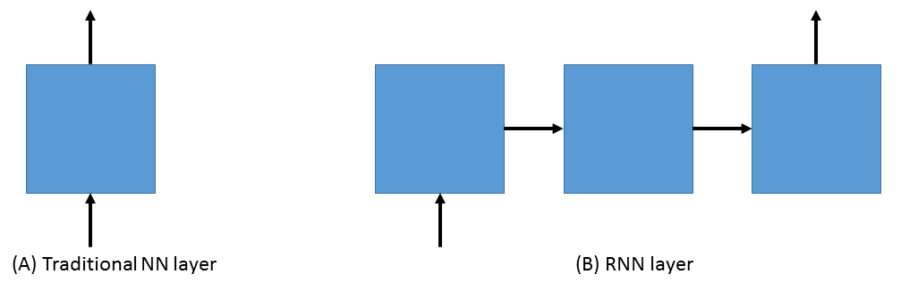
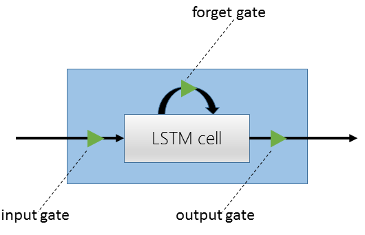

Getting started
===============

Installation
------------
This page will guide you through the following three required steps:

#. Make sure that all Python requirements are met
#. Build and install CNTK
#. Install the Python API and set it up

Requirements
~~~~~~~~~~~~
You will need the following Python packages: 

:Python: 2.7+ or 3.3+
:NumPy: 1.10
:Scipy: 0.17

On Linux a simple ``pip install`` should suffice. On Windows, you will get
everything you need from `Anaconda <https://www.continuum.io/downloads>`_.

Installing CNTK
~~~~~~~~~~~~~~~
Please follow the instructions on `CNTK's GitHub page 
<https://github.com/Microsoft/CNTK/wiki/Setup-CNTK-on-your-machine>`_. 
After you have built the CNTK binary, find the build location. It will be 
something like ``<cntkpath>/x64/Release/cntk``. You will need this for 
the next step.

Installing the Python module
~~~~~~~~~~~~~~~~~~~~~~~~~~~~
#. Go to ``<cntkpath>/contrib/Python`` and run ``python setup.py install``
#. Set up the environment variable ``CNTK_EXECUTABLE_PATH`` to point to the
   CNTK executable
#. Enjoy Python's ease of use with CNTK's speed::

    >>> import cntk as cn
    >>> cn.__version__
    1.4
    >>> with cn.Context('demo', clean_up=False) as ctx:
    ...     a = cn.constant([[1,2], [3,4]])
    ...     print(ctx.eval(a + [[10,20], [30, 40]]))
    [[11.0, 22.0], [33.0, 44.0]]

In this case, we have set ``clean_up=False`` so that you can now peek into the
folder ``_cntk_demo`` and see what has been created under the hood for you.

Most likely, you will find issues or rough edges. Please help us improve CNTK
by posting any problems to https://github.com/Microsoft/CNTK/issues. Thanks!

Overview and first run
----------------------

CNTK is a powerful toolkit appropriate for everything from complex deep learning 
research to distributed production environment serving of learned models. It is 
also great for learning, however, and we will start with a basic regression example 
to get comfortable with the API. Then, we will look at an area where CNTK shines: 
working with sequences, where we will demonstrate state-of-the-art sequence classification 
with an LSTM (long short term memory network).

First basic use
~~~~~~~~~~~~~~~

The CNTK Python API allows users to easily define a computational network, define the data 
that will pass through the network, setup how learning should be performed, and finally, train 
and test the network. Here we will go through a simple example of using the CNTK Python API to 
learn to separate data into two classes. Following the code, some basic CNTK concepts will be 
explained::

    import cntk as C
    import numpy as np

    def simple_network():
        # 500 samples, 250-dimensional data
        N = 500
        d = 250

        # create synthetic data using numpy
        X = np.random.randn(N, d)
        Y = np.random.randint(size=(N, 1), low=0, high=2)
        Y = np.hstack((Y, 1-Y))

        # set up the training data for CNTK
        x = C.input_numpy(X, has_dynamic_axis=False)
        y = C.input_numpy(Y, has_dynamic_axis=False)

        # define our network parameters: a weight tensor and a bias
        W = C.parameter((2, d))
        b = C.parameter((2, 1))
		
        # create a dense 'layer' by multiplying the weight tensor and  
        # the features and adding the bias
        out = C.times(W, x) + b

        # setup the criterion node using cross entropy with softmax
        ce = C.cross_entropy_with_softmax(y, out, name='loss')
        ce.tag = 'criterion'

        # define our SGD parameters and train!
        my_sgd = C.SGDParams(epoch_size=0, minibatch_size=25, learning_rates_per_mb=0.1, max_epochs=3)
        with C.LocalExecutionContext('logreg') as ctx:
            ctx.train(root_nodes=[ce], training_params=my_sgd)	        
            print(ctx.test(root_nodes=[ce]))

In the example above, we first create a synthetic data set of 500 samples, each with a 2-dimensional 
one-hot vector representing 0 (``[1 0]``) or 1 (``[0 1]``). We then begin describing the topology of our network 
by setting up the data inputs. This is typically done using the :class:`cntk.reader.CNTKTextFormatReader` by reading data 
in from a file, but for interactive experimentation and small examples we can use the ``input_numpy`` reader to 
access numpy data. Because dealing with dynamic axis data and sequences is where CNTK really shines, 
the default input data has a dynamic axis defined. Since we're not dealing with dynamic axes here, we 
set ``has_dynamic_axis`` to False.

Next, we define our network. In this case it's a simple 1-layer network with a weight tensor and a bias. 
We multiply our data `x` with the weight tensor `W` and add the bias `b`. We then input the model prediction 
into the :func:`cntk.ops.cross_entropy_with_softmax` node. This node first runs the data through a `softmax` to get 
probabilities for each class. Then the Cross Entropy loss function is applied. We tag the node `ce` with 
"criterion" so that CNTK knows it's a node from which the learning can start flowing back through the network.

Finally, we define our learning algorithm. In this case we use Stochastic Gradient Descent (SGD) and pass in 
some basic parameters. First, `epoch_size` allows different amounts of data per epoch. When we set it to 0, 
SGD looks at all of the training data in each epoch. Next, `minibatch_size` is the number of samples to look 
at for each minibatch; `learning_rates_per_mb` is the learning rate that SGD will use when the parameters are 
updated at the end of each minibatch; and `max_epochs` is the maximum number of epochs to train for.

The last step is to set up an execution context. An execution context can be either `Local` or `Deferred`. In the 
former case, as we use here, the methods (such as training and testing the network) are done locally and 
immediately so that the result is returned interactively to python. With a `Deferred` context, the methods simply 
set up a configuration file that can be used with CNTK at a later date. Here, with the local execution context, 
we train the network by passing in the root node and the optimizer we are using, and finally, we test its 
performance. Here is the output of the above example:

``{'SamplesSeen': 500, 'Perplexity': 1.1140191, 'loss': 0.10797427}``

Now that we've seen some of the basics of setting up and training a network using the CNTK Python API, 
let's look at a more interesting deep learning problem in more detail.

Sequence classification
~~~~~~~~~~~~~~~~~~~~~~~

One of the most exciting areas in deep learning is the powerful idea of recurrent 
neural networks (RNNs). RNNs are in some ways the Hidden Markov Models of the deep 
learning world. They are networks with loops in them and they allow us to model the 
current state given the result of a previous state. In other words, they allow information 
to persist. So, while a traditional neural network layer can be thought of as having data 
flow through as in the figure on the left below, an RNN layer can be seen as the figure 
on the right.

	
As is apparent from the figure above on the right, RNNs are the natural structure for 
dealing with sequences. This includes everything from text to music to video; anything 
where the current state is dependent on the previous state. While RNNs are indeed 
powerful, the "vanilla" RNN suffers from an important problem: long-term dependencies. 
Because the gradient needs to flow back through the network to learn, the contribution 
from an early element (for example a word at the start of a sentence) on a much later 
elements (like the last word) can essentially vanish.

To deal with the above problem, we turn to the Long Short Term Memory (LSTM) network. 
LSTMs are a type of RNN that are exceedingly useful and in practice are what we commonly 
use when implementing an RNN. For more on why LSTMs are so powerful, see, e.g. 
http://colah.github.io/posts/2015-08-Understanding-LSTMs. For our purposes, we will 
concentrate on the central feature of the LSTM model: the `memory cell`. 

	
    An LSTM cell.

The LSTM cell is associated with three gates that control how information is stored / 
remembered in the LSTM. The "forget gate" determines what information should be kept 
after a single element has flowed through the network. It makes this determination 
using data for the current time step and the previous hidden state. 

The "input gate" uses the same information as the forget gate, but passes it through 
a `tanh` to determine what to add to the state. The final gate is the "output gate" 
and it modulates what information should be output from the LSTM cell. This time we 
also take the previous state's value into account in addition to the previous hidden 
state and the data of the current state. We have purposely left the full details out 
for conciseness, so please see the link above for a full understanding of how an LSTM 
works.

In our example, we will be using an LSTM to do sequence classification. But for even 
better results, we will also introduce an additional concept here: 
`word embeddings <https://en.wikipedia.org/wiki/Word_embedding>`_. 
In traditional NLP approaches, words are seen as single points in a high dimensional 
space (the vocabulary). A word is represented by an arbitrary id and that single number 
contains no information about the meaning of the word or how it is used. However, with 
word embeddings each word is represented by a learned vector that has some meaning. For 
example, the vector representing the word "cat" may somehow be close, in some sense, to 
the vector for "dog", and each dimension is encoding some similarities or differences 
between those words that were learned usually by analyzing a large corpus. In our task, 
we will use a pre-computed word embedding model (e.g. from `GloVe <http://nlp.stanford.edu/projects/glove/>`_) 
and each of the words in the sequences will be replaced by their respective GloVe vector.

Now that we've decided on our word representation and the type of recurrent neural 
network we want to use, let's define the computational network that we'll use to do 
sequence classification. We can think of the network as adding a series of layers:

1. Embedding layer (individual words in each sequence become vectors)
2. LSTM layer (allow each word to depend on previous words)
3. Softmax layer (an additional set of parameters and output probabilities per class)

We can define this network as follows in the CNTK Python API::

    import cntk as C

    def seqcla():    
        # model
        num_labels = 5
        vocab = 2000
        embed_dim = 50    
		
        # LSTM params
        input_dim = 50
        output_dim = 128
        cell_dim = 128

        t = C.dynamic_axis(name='t')
        # temporarily using cntk1 SpareInput because cntk2's input() will simply allow sparse as a parameter
        features = cntk1.SparseInput(vocab, dynamicAxis=t, name='features')    
        labels = C.input(num_labels, name='labels')
   
        train_reader = C.CNTKTextFormatReader(train_file)

        # setup embedding matrix
        embedding = C.parameter((embed_dim, vocab), 
                                 learning_rate_multiplier=0.0, 
                                 init_from_file_path=embedding_file)

        # get the vector representing the word
        sequence = C.times(embedding, features, name='sequence')
    
        # add an LSTM layer
        L = lstm_layer(output_dim, cell_dim, sequence, input_dim)
    
        # add a dense layer on top
        w = C.parameter((num_labels, output_dim), name='w')
        b = C.parameter((num_labels), name='b')
        z = C.plus(C.times(w, L), b, name='z')
        z.tag = "output"
    
        # and reconcile the shared dynamic axis
        pred = C.reconcile_dynamic_axis(z, labels, name='pred')    
    
        ce = C.cross_entropy_with_softmax(labels, pred)
        ce.tag = "criterion"

Let's go through some of the intricacies of the above network definition. First, we define 
some parameters of the data and the network. We have 5 possible classes for the sequences; 
we're working with a vocabulary of 2000 words; and our embedding vectors have a dimension of 
50. Because the word vectors are input to the LSTM, the `input_dim` of the LSTM is also 50. 
We can, however, output any dimension from the LSTM; our `cell_dim` and `output_dim` are the 
same and we output 128-dimensional tensors.

We then set up our training data. First, we create a dynamic axis. The dynamic axis is a key 
concept in CNTK that allows us to work with sequences without having to pad our data when we 
have sequences of different lengths (which is almost always the case). We then set up our 
features by defining a `SparseInput`. In this release, :func:`cntk.ops.input` only supports dense features 
so we have to use the legacy `cntk1.SparseInput` until 1.5. Each word has a dimension of size 
`vocab` and we attach the dynamic axis `t` that we created just above. Then we set up our labels 
using the standard :func:`cntk.ops.input` where the dimension is of size `num_labels`.

Our final piece of setup before beginning to define the network is creating a `reader` for our 
training data. We use the :class:`cntk.reader.CNTKTextFormatReader` and pass in the name of our 
training data file.

Now we can start defining our network. The first layer is the word embedding. We define this 
using a `parameter` of shape `(embed_dim, vocab)` that is initialized from a file where our 
embedding matrix is stored. We set the `learning_rate_multiplier` parameter to 0.0 so that this 
is treated as a constant.

To view the input data words as vectors, we multiply the embedding matrix with the one-hot vector 
words which results in the data being represented by vectors. An LSTM layer is then added which 
returns the last hidden state of the unrolled network. We then add the dense layer followed by 
the criterion node that adds a softmax and then implements the cross entropy loss function. Before 
we add the criterion node, however, we call :func:`cntk.ops.reconcile_dynamic_axis` which will ensure 
that the minibatch layout for the labels and the data with dynamic axes is compatible.

For the full explanation of how ``lstm_layer()`` is defined, please see the full example in the 
Examples section.

How to pass Python data as train/test data
~~~~~~~~~~~~~~~~~~~~~~~~~~~~~~~~~~~~~~~~~~

The Python CNTK API allows to pass training / testing data either by specifing external input files or by using Python data directly to CNTK.
This second alternative - using internal Python data - is usefull especially if you want to do some quick experimentation with small synthetic data sets.
In what follows you will learn in what structure these data has to be provided.

Let us start with a scenario coming from one of our code examples (`logreg_numpy.py <https://github.com/Microsoft/CNTK/tree/master/contrib/Python/cntk/examples/LogReg/logreg_numpy.py>`_).
In this example we want to classify a 250 dimensional feature vector into one of two classes. In this case whe have two *inputs*:
 - The features values for each training item. In the example these are 500 vectors each of dimension 250. 
 - The expected class. In this example the class is encoded with a two-dimensonal vector where the element for expected class is set to 1 and the other to 0.

For each of these inputs we have to provide one data structure containing all training instances. 

You might notice that this is conceptually different to the case where we provide the data from external files using the CNTKTextReader. 
In the input file for CNTKTextReader we provide data for different *inputs* of one instance on the same line, so the data from different inputs are much more interwined.

In Python the feature data are reprensented by a NumPy array of dimension ``number_of_instances X dimension_of_feature_space`` so in out example its a NumPy array of dimension ``500 X 250``.
Likewise the expected output is reprensented by another NumPy array of dimension ``500 X 2``.

Passing sequence data from Python
~~~~~~~~~~~~~~~~~~~~~~~~~~~~~~~~~

CNTK can handle sequences with arbitrary maximal length. This feature is also called *dynamic-axis*.
To represent an input with a dynamic-axis in Python you have to provide each sequence as a NumPy-array where the first axis has a dimension equal to the sequence length.
The complete dataset is then just a normal one-dimensional numpy array of these sequences.

Take as an artifical example a sentence classification problem. Each sentence has a different number of words, i.e. it is a *sequence* of words. The individual words might each be represented by some lantent vector.
So each sentence is represented by a NumPy array of dimension ``sequence_length X embedding_dimension``. The whole set of instances (sentences) is then represented by putting them into a one-dimensional array with the size equal to the number of instances.

 
