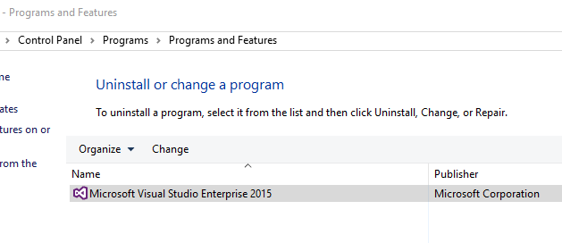
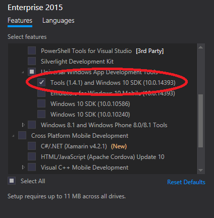
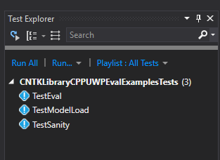

# Seting Development Environment for UWP

To build UWP configuratons `Release_UWP` and `Debug_UWP`, you need to do the following:

## Install Windows 10 SDK (10.0.14393).

Open Control Panel, then navigate to Add-Remove Programs. Select Visual Studio 2015:

Click 'Change'. When the Visual Studio setup starts, select Tools under Universal Windows Apps Development Tools:

This will take a few minutes to install.

## Enable UWP build for CNTK

Set the environment variable `CNTK_ENABLE_UWP` to `true`:

    setx CNTK_ENABLE_UWP true

Then restart Visual Studio

## Get OpenBLAS

OpenBLAS is used al alternative math library for UWP (unlike Desktop configurations, which use MKL)

You can either use the pre-built version of OpenBLAS, or build it yourself.

### Using Pre-build OpenBLAS

To use the pre-built OpenBLAS library, get it from [here](https://todo) and copy to a local directory, for example `c:\local\OpenBLAS\1`. Set `CNTK_OPENBLAS_PATH` to point to your local installation:

    setx CNTK_OPENBLAS_PATH c:\local\OpenBLAS

To validate, file `%CNTK_OPENBLAS_PATH%\1\cblas.h` must exist.

### Build OpenBLAS from source

This is an alternative to using the pre-built OpenBLAS library. Follow instructons from [here](https://github.com/xianyi/OpenBLAS/wiki/How-to-use-OpenBLAS-in-Microsoft-Visual-Studio), then copy the resulting files into a local directory as described above, setting the `CNTK_OPENBLAS_PATH` environment variable.

# Build UWP configurations

Now open Visual Studio and build `Release_UWP` or `Debug_UWP` configurations. 

# Running tests

UWP-specific tests are located in `CNTKLibraryCPPUWPEvalExamplesTests` directory. 

Open Test Explorer windows in Visual Studio. You should see a list of tests like this:

Click 'Run All'. The tests should pass.
